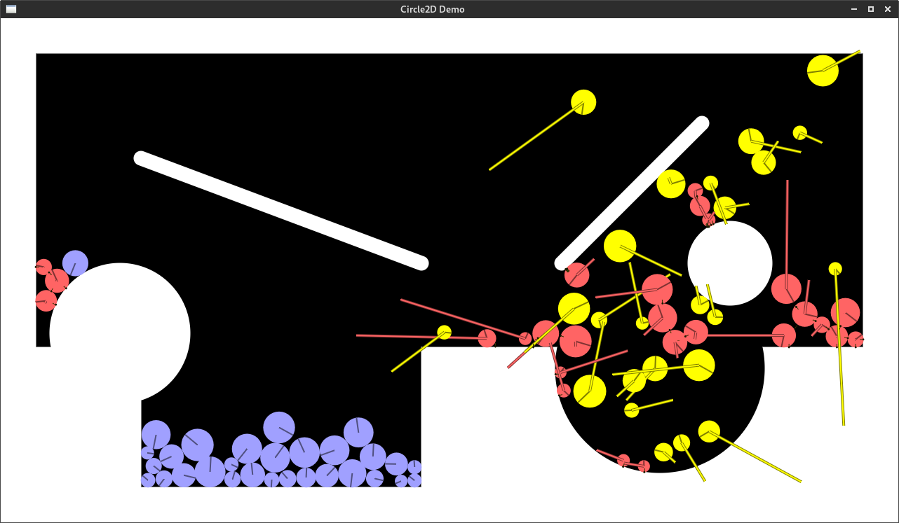

# Circle2D

Circle2D is a little physics library used for my game [CrateBeforeAttack](https://CrateBeforeAttack.com).



It is not production ready, supports only circular shapes and distance fields.
It borrows concept and algorithms from incredible
[Box2D-Lite](https://github.com/erincatto/box2d-lite) by [Erin
Catto](https://github.com/erincatto) and amazing [Chipmunk2D](https://github.com/slembcke/Chipmunk2D).

To run example:
```
cargo run --release --example basic
```
